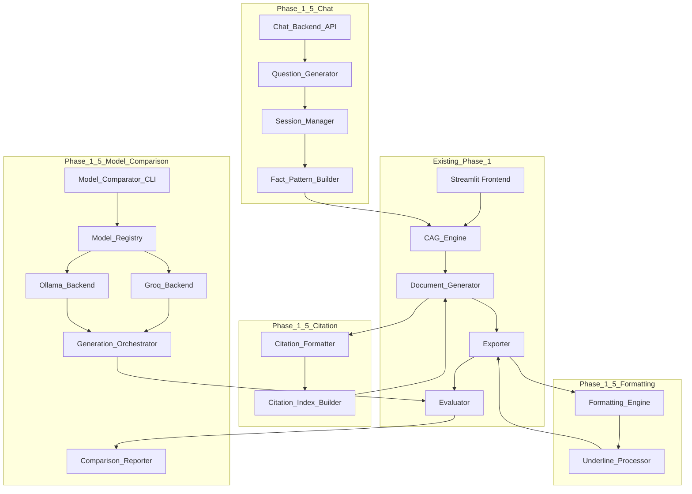

# Design Document: Phase 1.5 Enhancements

## Overview

Phase 1.5 enhances the Maharashtra Legal Document Generation System with three critical improvements that maintain backward compatibility while adding research-grade evaluation capabilities and production-ready deployment infrastructure:

1. **Citation and Formatting Refinements**: Professional document output with end-of-document citation indices and Maharashtra legal drafting conventions (underlined clauses and party names)
2. **Small Language Model (SLM) Comparison Infrastructure**: Research-grade evaluation framework comparing 3-6 models (≤10B parameters for accessibility, with optional 70B+ variants) across 7 document types
3. **Conversational Chat Backend**: Production-ready REST API for guided document generation through natural language Q&A

### Key Design Decisions

- **Citation system over inline markers**: End-of-document citation indices improve readability and align with legal document conventions while maintaining full traceability
- **Groq + Ollama hybrid for 100% free inference**: Llama models via Groq free tier (cloud, fast), Qwen/Gemma via Ollama local (free, requires 16-32GB RAM)
- **≤10B parameter focus with optional large models**: Required models (Llama 3.1 8B, Qwen 2.5 7B, Gemma 4 9B) run on 16GB RAM; optional models (Llama 70B, Qwen 32B, Gemma 31B) require 32GB RAM and are auto-detected
- **FastAPI chat backend as separate service**: Decoupled from Streamlit frontend for independent scaling and cloud deployment
- **Feature flags for gradual rollout**: Each enhancement can be enabled/disabled independently via environment variables
- **Backward compatibility guarantee**: All Phase 1 functionality remains unchanged when Phase 1.5 features are disabled

## Architecture

### System Context

Phase 1.5 extends the existing two-pass CAG generation pipeline with three new subsystems:



### Data Flow: Citation Formatting

```
LLM generates slot content with [CITE:Act, Year, Section X] markers
        │
        ▼
Citation_Formatter.collect_citations()
  - Parse [CITE:...] markers
  - Assign sequential reference numbers
  - Build citation→number mapping
        │
        ▼
Citation_Formatter.replace_markers()
  - Replace [CITE:...] with [N]
  - Track clause indices for each citation
        │
        ▼
Citation_Index_Builder.build()
  - Format citations per Indian Legal Citation Standard
  - Group by first appearance order
  - Append to document body
        │
        ▼
Document with inline [1], [2], [3] markers + end-of-document CITATION INDEX
```

### Data Flow: Model Comparison

```
User runs: python scripts/run_model_comparison.py --models all --doc-types all
        │
        ▼
Model_Comparator loads fact patterns (7 document types)
        │
        ▼
For each (model, preset, doc_type):
  Model_Registry.get_backend(model) → Groq_Backend or Ollama_Backend
  Generation_Orchestrator.generate(fact_pattern, model, preset)
  Evaluator.evaluate_cag_document() → Tier 1+2 metrics
  (Optional) Evaluator.evaluate_ragas() → Tier 3 metrics
        │
        ▼
Comparison_Reporter.export_csv() → output/model_comparison/results.csv
Comparison_Reporter.export_json() → output/model_comparison/results.json
Comparison_Reporter.generate_summary() → output/model_comparison/summary.md
```

### Data Flow: Chat Backend

```
User → POST /api/chat/start {"doc_type": "sale_deed"}
        │
        ▼
Chat_Backend creates session_id, loads intake schema
Question_Generator.get_first_question() → "Please provide the full name of the Seller (Vendor)"
        │
        ▼
User → POST /api/chat/respond {"session_id": "...", "answer": "Rajesh Kumar Sharma"}
        │
        ▼
Session_Manager validates answer, stores in session
Question_Generator.get_next_question() → "Please provide the Seller's address"
        │
        ▼
... (repeat for all required fields) ...
        │
        ▼
All fields collected → Fact_Pattern_Builder.build() → enriched fact pattern dict
        │
        ▼
Response: {"status": "complete", "fact_pattern": {...}}
        │
        ▼
User → POST /api/generate {"session_id": "...", "fact_pattern": {...}}
        │
        ▼
CAG_Engine.generate_draft() → existing Phase 1 pipeline
```

## Components and Interfaces

### Citation_Formatter

Collects citations during generation and builds end-of-document citation index.

**Interface:**

```python
@dataclass
class CitationMarker:
    act_name: str
    year: str
    section: str
    court_or_legislature: str
    judgment_year: str | None
    clause_index: int           # which clause in the draft this appears in

@dataclass
class CitationIndex:
    citations: list[CitationMarker]
    citation_map: dict[str, int]  # citation_key → reference_number
    formatted_index: str          # ready-to-append text block

def collect_citations(text: str) -> tuple[str, list[CitationMarker]]:
    """
    Parse [CITE:Act, Year, Section X] markers from LLM output.
    Returns (text_with_markers_intact, list_of_citation_markers).
    """

def assign_reference_numbers(citations: list[CitationMarker]) -> dict[str, int]:
    """
    Assign sequential reference numbers to citations in order of first appearance.
    Returns citation_key → reference_number mapping.
    """

def replace_markers(text: str, citation_map: dict[str, int]) -> str:
    """
    Replace [CITE:...] markers with [N] reference numbers.
    """

def build_citation_index(citations: list[CitationMarker]) -> str:
    """
    Format citations as numbered list per Indian Legal Citation Standard.
    Returns formatted text block ready to append to document.
    """
```

**Citation key format**: `{act_name}|{year}|{section}` (normalized, case-insensitive)

**Indian Legal Citation Standard format**:
```
[Act Name, Year] Section X(Y), [Court/Legislature], [Year]
```

**Example output**:
```
--- CITATION INDEX ---

[1] [Transfer of Property Act, 1882] Section 54, Parliament of India, 1882
    Cited in clause(s): 3, 7

[2] [Registration Act, 1908] Section 17(1)(b), Parliament of India, 1908
    Cited in clause(s): 8

[3] [Maharashtra Stamp Act, 1958] Article 25, Maharashtra Legislature, 1958
    Cited in clause(s): 9
```

---

### Formatting_Engine

Applies underlining to party names and operative clauses per Maharashtra legal drafting conventions.

**Interface:**

```python
@dataclass
class FormattingRule:
    pattern: re.Pattern
    format_type: str  # "underline" | "bold" | "italic"
    scope: str        # "party_name" | "operative_clause" | "section_heading"

def detect_party_names(text: str, doc_type: str) -> list[tuple[int, int, str]]:
    """
    Detect party names in text using document-type-specific patterns.
    Returns list of (start_offset, end_offset, party_role) tuples.
    """

def detect_operative_clauses(text: str) -> list[tuple[int, int]]:
    """
    Detect operative clause headings (NOW THIS DEED WITNESSETH, etc.).
    Returns list of (start_offset, end_offset) tuples.
    """

def apply_underline_docx(doc: Document, ranges: list[tuple[int, int]]) -> Document:
    """
    Apply underlining to specified character ranges in python-docx Document.
    """

def apply_underline_pdf(pdf_content: bytes, ranges: list[tuple[int, int]]) -> bytes:
    """
    Apply underlining to specified character ranges in PDF (reportlab).
    """
```

**Party name patterns by document type**:

| Document Type | Party Roles |
|---|---|
| Sale Deed | Vendor, Purchaser, Vendee |
| Mortgage Deed | Mortgagor, Mortgagee |
| Power of Attorney | Principal, Attorney, Agent |
| Leave and License | Licensor, Licensee |
| Gift Deed | Donor, Donee |
| Conveyance Deed | Conveyor, Transferee |
| Affidavit | Deponent |

**Operative clause patterns**:
- `NOW THIS DEED WITNESSETH`
- `IT IS HEREBY AGREED`
- `THE PARTIES AGREE`
- `IN CONSIDERATION WHEREOF`

**Fallback heuristic**: If LLM does not output `<UNDERLINE>...</UNDERLINE>` markers, use regex to detect:
- Party names: capitalized words following role keywords (e.g., "Vendor Shri Rajesh Kumar Sharma")
- Operative clauses: all-caps lines ending with colon or starting with "NOW", "IT IS HEREBY"

---

### Model_Registry

Central registry for all supported LLM models with backend routing and parameter presets.

**Interface:**

```python
@dataclass
class ModelConfig:
    model_id: str               # "llama-3.1-8b", "qwen-2.5-7b", "gemma-4-9b"
    display_name: str
    provider: str               # "groq" | "ollama"
    api_endpoint: str           # Groq URL or Ollama URL
    parameter_count: int        # in billions
    context_window: int         # max tokens
    required: bool              # True for ≤10B models, False for 70B+ optional models
    ram_required_gb: int        # minimum RAM to run this model

@dataclass
class ParameterPreset:
    name: str                   # "high_quality" | "fast"
    temperature: float
    top_p: float
    max_tokens: int

MODEL_REGISTRY: dict[str, ModelConfig] = {
    "llama-3.1-8b": ModelConfig(
        model_id="llama-3.1-8b-instant",
        display_name="Llama 3.1 8B",
        provider="groq",
        api_endpoint="https://api.groq.com/openai/v1",
        parameter_count=8,
        context_window=128000,
        required=True,
        ram_required_gb=0,  # cloud-based, no local RAM needed
    ),
    "qwen-2.5-7b": ModelConfig(
        model_id="qwen2.5:7b",
        display_name="Qwen 2.5 7B",
        provider="ollama",
        api_endpoint="http://localhost:11434",
        parameter_count=7,
        context_window=32768,
        required=True,
        ram_required_gb=8,
    ),
    "gemma-4-9b": ModelConfig(
        model_id="gemma4:9b",
        display_name="Gemma 4 9B",
        provider="ollama",
        api_endpoint="http://localhost:11434",
        parameter_count=9,
        context_window=8192,
        required=True,
        ram_required_gb=10,
    ),
    # Optional large models (auto-disabled if RAM < 32GB)
    "llama-3.3-70b": ModelConfig(
        model_id="llama-3.3-70b-versatile",
        display_name="Llama 3.3 70B",
        provider="groq",
        api_endpoint="https://api.groq.com/openai/v1",
        parameter_count=70,
        context_window=128000,
        required=False,
        ram_required_gb=0,  # cloud-based
    ),
    "qwen-3-32b": ModelConfig(
        model_id="qwen3:32b",
        display_name="Qwen 3 32B",
        provider="ollama",
        api_endpoint="http://localhost:11434",
        parameter_count=32,
        context_window=32768,
        required=False,
        ram_required_gb=20,
    ),
    "gemma-4-31b": ModelConfig(
        model_id="gemma4:31b-instruct",
        display_name="Gemma 4 31B Instruct",
        provider="ollama",
        api_endpoint="http://localhost:11434",
        parameter_count=31,
        context_window=8192,
        required=False,
        ram_required_gb=20,
    ),
}

PARAMETER_PRESETS: dict[str, ParameterPreset] = {
    "high_quality": ParameterPreset(
        name="high_quality",
        temperature=0.1,
        top_p=0.9,
        max_tokens=1000,
    ),
    "fast": ParameterPreset(
        name="fast",
        temperature=0.3,
        top_p=0.95,
        max_tokens=600,
    ),
}

def get_available_models(include_large: bool = False) -> list[ModelConfig]:
    """
    Return list of available models based on system RAM.
    If include_large=False, return only required models (≤10B).
    If include_large=True, check system RAM and return all models that fit.
    """

def get_backend(model_id: str) -> Groq_Backend | Ollama_Backend:
    """
    Return the appropriate backend instance for the given model.
    """
```

**RAM detection logic**:
```python
import psutil

def detect_system_ram_gb() -> int:
    return psutil.virtual_memory().total // (1024 ** 3)

def filter_models_by_ram(models: list[ModelConfig], available_ram_gb: int) -> list[ModelConfig]:
    return [m for m in models if m.ram_required_gb <= available_ram_gb]
```

---

### Model_Comparator

Orchestrates document generation across multiple model-parameter combinations and collects evaluation metrics.

**Interface:**

```python
@dataclass
class ComparisonRun:
    run_id: str
    model_id: str
    parameter_preset: str
    doc_type: str
    fact_pattern: dict
    generated_document: GeneratedDocument
    evaluation_result: CAGEvaluationResult
    latency_seconds: float
    token_count: int
    backend: str  # "groq" | "ollama"

@dataclass
class ComparisonReport:
    runs: list[ComparisonRun]
    summary: dict[str, dict[str, float]]  # model_id → metric → {mean, std, median}
    best_models: dict[str, str]           # metric → best_model_id
    failed_runs: list[dict[str, str]]     # [{model, doc_type, error}, ...]

def run_comparison(
    models: list[str],
    presets: list[str],
    doc_types: list[str],
    fact_patterns: dict[str, dict],
    output_dir: Path,
) -> ComparisonReport:
    """
    Execute document generation for all (model, preset, doc_type) combinations.
    Returns ComparisonReport with all results and summary statistics.
    """

def export_csv(report: ComparisonReport, output_path: Path) -> None:
    """
    Export results as CSV with one row per run.
    Columns: timestamp, model_id, parameter_preset, doc_type, run_id,
             cache_hit_rate, slot_fill_rate, fact_fidelity_score,
             section_completeness, citation_format_compliance,
             jurisdictional_accuracy, latency_seconds, token_count, backend
    """

def export_json(report: ComparisonReport, output_path: Path) -> None:
    """
    Export results as nested JSON:
    {
      "runs": [...],
      "summary": {...},
      "best_models": {...},
      "failed_runs": [...]
    }
    """

def generate_summary_markdown(report: ComparisonReport, output_path: Path) -> None:
    """
    Generate Markdown report with comparison tables and best model recommendations.
    """
```

**Progress tracking**:
```python
from tqdm import tqdm

total_runs = len(models) * len(presets) * len(doc_types)
with tqdm(total=total_runs, desc="Model Comparison") as pbar:
    for model in models:
        for preset in presets:
            for doc_type in doc_types:
                # ... generate and evaluate ...
                pbar.set_postfix(model=model, doc_type=doc_type)
                pbar.update(1)
```

---

### Chat_Backend (FastAPI)

REST API for conversational document generation.

**Endpoints:**

```python
@app.post("/api/chat/start")
def start_chat(request: ChatStartRequest) -> ChatStartResponse:
    """
    Initialize a new chat session for the given document type.
    Returns session_id and first question.
    """

@app.post("/api/chat/respond")
def respond(request: ChatRespondRequest) -> ChatRespondResponse:
    """
    Process user answer and return next question or completion signal.
    """

@app.post("/api/chat/revise")
def revise(request: ChatReviseRequest) -> ChatReviseResponse:
    """
    Allow user to revise a previous answer.
    Returns updated question sequence.
    """

@app.get("/health")
def health_check() -> dict:
    """
    Health check endpoint for load balancers.
    Returns {"status": "healthy", "timestamp": "..."}.
    """

@app.get("/admin/sessions")
def list_sessions(api_key: str = Header(..., alias="X-API-Key")) -> dict:
    """
    Admin endpoint: list active sessions.
    Requires API key authentication.
    """
```

**Request/Response schemas:**

```python
class ChatStartRequest(BaseModel):
    doc_type: str  # one of 7 document types

class ChatStartResponse(BaseModel):
    session_id: str
    question: str
    field_type: str  # "text" | "number" | "date" | "select"
    options: list[str] | None  # for select fields
    help_text: str | None

class ChatRespondRequest(BaseModel):
    session_id: str
    answer: str | int | float | list[str]

class ChatRespondResponse(BaseModel):
    status: str  # "continue" | "complete" | "error"
    question: str | None  # next question if status="continue"
    field_type: str | None
    options: list[str] | None
    help_text: str | None
    fact_pattern: dict | None  # populated if status="complete"
    error_message: str | None  # populated if status="error"

class ChatReviseRequest(BaseModel):
    session_id: str
    field_id: str  # which field to revise
    new_answer: str | int | float | list[str]

class ChatReviseResponse(BaseModel):
    status: str  # "revised" | "error"
    question: str | None  # next question after revision
    error_message: str | None
```

---

### Question_Generator

Converts intake schema fields to natural language questions.

**Interface:**

```python
@dataclass
class Question:
    field_id: str
    text: str
    field_type: str
    options: list[str] | None
    help_text: str | None
    validation_rules: dict[str, Any]  # {"min": 0, "max": 100000000, "pattern": "..."}

def generate_question(field: dict, doc_type: str, ocr_fields: dict | None = None) -> Question:
    """
    Convert intake schema field to natural language question.
    If ocr_fields contains a value for this field, format as confirmation question.
    """

def format_confirmation_question(field_label: str, ocr_value: str) -> str:
    """
    Format OCR pre-fill as confirmation question.
    Example: "We detected Survey Number 123/4A from your document. Is this correct?"
    """
```

**Question templates by field type**:

| Field Type | Template |
|---|---|
| text | "Please provide {field_label}" |
| textarea | "Please describe {field_label}" |
| number | "Enter the {field_label} (numeric value)" |
| date | "What is the {field_label}? (format: DD/MM/YYYY)" |
| select | "Choose the {field_label} from the following options:" |
| multiselect | "Select all applicable {field_label}:" |
| boolean | "Is {field_label}? (yes/no)" |

**Example questions by document type**:

**Sale Deed**:
1. "Please provide the full name of the Seller (Vendor) as it appears on the 7/12 Extract"
2. "Please provide the Seller's complete address"
3. "Please provide the full name of the Buyer (Purchaser)"
4. "Please provide the Buyer's complete address"
5. "Enter the total consideration amount (sale price) in Rupees"
6. "Choose the payment mode: Cash, Cheque, Bank Transfer, or Mixed"
7. "Enter the advance amount paid (if any) in Rupees"
8. "We detected Survey Number 123/4A from your document. Is this correct?"

**Power of Attorney**:
1. "Please provide the full name of the Principal (person granting authority)"
2. "Please provide the Principal's complete address"
3. "Please provide the full name of the Attorney (person receiving authority)"
4. "Please provide the Attorney's complete address"
5. "Is this a General Power of Attorney (broad authority) or Special Power of Attorney (limited to specific transaction)?"
6. "Select all powers being granted to the Attorney: [Sell property, Purchase property, Mortgage property, Execute documents, Appear in court, Manage bank accounts, File tax returns, Other]"
7. "Is this Power of Attorney revocable or irrevocable?"

---

### Session_Manager

Manages chat session state with Redis or in-memory storage.

**Interface:**

```python
@dataclass
class ChatSession:
    session_id: str
    doc_type: str
    intake_schema: dict
    answers: dict[str, Any]
    current_field_index: int
    created_at: datetime
    last_activity: datetime
    ocr_fields: dict | None

def create_session(doc_type: str, ocr_fields: dict | None = None) -> ChatSession:
    """
    Create a new chat session with a UUID session_id.
    Load intake schema for the document type.
    """

def get_session(session_id: str) -> ChatSession | None:
    """
    Retrieve session from store. Returns None if expired or not found.
    """

def update_session(session: ChatSession) -> None:
    """
    Update session in store and refresh last_activity timestamp.
    """

def store_answer(session_id: str, field_id: str, answer: Any) -> None:
    """
    Store user answer in session and advance current_field_index.
    """

def purge_expired_sessions(ttl_minutes: int = 30) -> int:
    """
    Remove sessions with last_activity older than ttl_minutes.
    Returns count of purged sessions.
    """
```

**Redis storage schema**:
```
Key: chat:session:{session_id}
Value: JSON-serialized ChatSession
TTL: 30 minutes (refreshed on every update)
```

**In-memory storage**:
```python
_sessions: dict[str, ChatSession] = {}
_session_lock = threading.Lock()
```

**Background purge task** (runs every 5 minutes):
```python
@app.on_event("startup")
async def start_purge_task():
    asyncio.create_task(purge_task())

async def purge_task():
    while True:
        await asyncio.sleep(300)  # 5 minutes
        count = purge_expired_sessions(ttl_minutes=30)
        logger.info(f"Purged {count} expired chat sessions")
```

---

### Comparison_Reporter

Generates comparison reports in multiple formats (CSV, JSON, Markdown).

**Interface:**

```python
def export_csv(report: ComparisonReport, output_path: Path) -> None:
    """
    Export detailed results as CSV with one row per run.
    """

def export_summary_csv(report: ComparisonReport, output_path: Path) -> None:
    """
    Export summary statistics as CSV with one row per model-parameter combination.
    Columns: model_id, parameter_preset, mean_cache_hit_rate, std_cache_hit_rate,
             mean_slot_fill_rate, std_slot_fill_rate, ...
    """

def export_json(report: ComparisonReport, output_path: Path) -> None:
    """
    Export full report as nested JSON.
    """

def generate_summary_markdown(report: ComparisonReport, output_path: Path) -> None:
    """
    Generate Markdown report with:
    - Executive summary table (best model per metric)
    - Per-metric comparison tables
    - Latency comparison
    - Failed runs section
    """
```

**Markdown report structure**:

```markdown
# Model Comparison Report

Generated: 2026-01-15 14:30:00

## Executive Summary

| Metric | Best Model | Score |
|---|---|---|
| Cache Hit Rate | llama-3.1-8b (high_quality) | 0.92 |
| Slot Fill Rate | qwen-2.5-7b (high_quality) | 0.88 |
| Fact Fidelity | gemma-4-9b (high_quality) | 0.85 |
| Section Completeness | llama-3.1-8b (high_quality) | 0.94 |
| Latency | llama-3.1-8b (fast) | 3.2s |

## Cache Hit Rate Comparison

| Model | High Quality | Fast |
|---|---|---|
| Llama 3.1 8B | 0.92 ± 0.04 | 0.89 ± 0.06 |
| Qwen 2.5 7B | 0.87 ± 0.05 | 0.84 ± 0.07 |
| Gemma 4 9B | 0.85 ± 0.06 | 0.82 ± 0.08 |

... (additional tables for each metric) ...

## Failed Runs

- qwen-2.5-7b / fast / mortgage_deed: Ollama timeout after 60s
- gemma-4-9b / high_quality / affidavit: HTTP 500 from Ollama

## Recommendations

For production deployment:
- **Best overall quality**: Llama 3.1 8B (high_quality preset) via Groq API
- **Best speed**: Llama 3.1 8B (fast preset) via Groq API
- **Best local inference**: Qwen 2.5 7B (high_quality preset) via Ollama

```

## Data Models

### Citation Data Structures

```python
@dataclass
class CitationMarker:
    act_name: str
    year: str
    section: str
    court_or_legislature: str
    judgment_year: str | None
    clause_index: int
    first_appearance_index: int  # for ordering in citation index

@dataclass
class CitationIndex:
    citations: list[CitationMarker]
    citation_map: dict[str, int]  # citation_key → reference_number
    formatted_index: str

# Citation key normalization
def normalize_citation_key(act: str, year: str, section: str) -> str:
    return f"{act.lower().strip()}|{year}|{section.lower().strip()}"
```

### Model Comparison Data Structures

```python
@dataclass
class ComparisonRun:
    run_id: str
    timestamp: datetime
    model_id: str
    parameter_preset: str
    doc_type: str
    fact_pattern: dict
    generated_document: GeneratedDocument
    evaluation_result: CAGEvaluationResult
    latency_seconds: float
    token_count: int
    backend: str

@dataclass
class ComparisonReport:
    runs: list[ComparisonRun]
    summary: dict[str, dict[str, float]]
    best_models: dict[str, str]
    failed_runs: list[dict[str, str]]
    total_runs: int
    successful_runs: int
    total_duration_seconds: float

@dataclass
class MetricSummary:
    model_id: str
    parameter_preset: str
    metric_name: str
    mean: float
    median: float
    std: float
    min: float
    max: float
    sample_count: int
```

### Chat Session Data Structures

```python
@dataclass
class ChatSession:
    session_id: str
    doc_type: str
    intake_schema: dict
    answers: dict[str, Any]
    current_field_index: int
    created_at: datetime
    last_activity: datetime
    ocr_fields: dict | None
    question_history: list[tuple[str, str]]  # [(question, answer), ...]

@dataclass
class Question:
    field_id: str
    text: str
    field_type: str
    options: list[str] | None
    help_text: str | None
    validation_rules: dict[str, Any]
    ocr_prefill: str | None

@dataclass
class ValidationResult:
    valid: bool
    error_message: str | None
    normalized_value: Any  # type-coerced value if valid
```

### Environment Configuration

**New environment variables** (added to `.env.example`):

```bash
# Phase 1.5 Feature Flags
ENABLE_PHASE_1_5=true
ENABLE_CITATION_FORMATTING=true
ENABLE_UNDERLINE_FORMATTING=true
ENABLE_MODEL_COMPARISON=true
ENABLE_CHAT_BACKEND=true

# Model Comparison
MODEL_COMPARISON_OUTPUT_DIR=./output/model_comparison
INCLUDE_LARGE_MODELS=false  # auto-detect based on RAM if true

# Chat Backend
CHAT_BACKEND_PORT=8000
CHAT_SESSION_STORE=memory  # "memory" | "redis"
REDIS_URL=redis://localhost:6379/0
CHAT_SESSION_TTL_MINUTES=30
CORS_ORIGINS=http://localhost:3000,http://localhost:8501

# Rate Limiting
RATE_LIMIT_PER_MINUTE=100
RATE_LIMIT_PER_HOUR=1000

# Admin API Key (for /admin/sessions endpoint)
ADMIN_API_KEY=your-secret-admin-key-here
```

## Correctness Properties

*A property is a characteristic or behavior that should hold true across all valid executions of a system — essentially, a formal statement about what the system should do. Properties serve as the bridge between human-readable specifications and machine-verifiable correctness guarantees.*


### Property Reflection

After analyzing all acceptance criteria, I identified the following redundancies and consolidations:

**Citation Formatting (Requirements 1-3)**:
- Properties 1.1, 1.2, 1.3, 1.4, 1.6 can be consolidated into comprehensive citation system properties
- Property 1.7 (all document types) is redundant with 2.4 (formatting for all types) - combine into one cross-cutting property
- Properties 3.2, 3.3, 3.4, 3.5 are transformation steps of the same pipeline - combine into marker transformation properties

**Model Comparison (Requirements 4-6)**:
- Properties 5.1, 5.2, 5.3 (Tier 1/2/3 metrics) can be consolidated into one comprehensive evaluation property
- Properties 4.6 and 4.7 (metadata recording and evaluation) are part of the same workflow - combine
- Properties 5.4, 5.5 (CSV and JSON export) test the same data in different formats - combine into one export property

**Chat Backend (Requirements 7-10)**:
- Properties 7.2, 8.1, 8.3 (question generation) test the same question generation logic - combine
- Properties 7.6 and 10.4 (session storage) test the same persistence mechanism - combine
- Properties 9.6 and 19.3 (rate limiting) are duplicate - combine

**Error Handling (Requirement 17)**:
- Properties 17.1, 17.2, 17.3, 17.4 test different aspects of the same error handling system - combine into comprehensive error resilience property

After consolidation, 35 unique properties remain that provide comprehensive coverage without redundancy.

### Property 1: Citation Reference Number Assignment

*For any* generated document containing N citations, the Citation_Formatter SHALL assign sequential reference numbers 1, 2, ..., N in order of first appearance, and when the same citation appears multiple times, all occurrences SHALL use the same reference number.

**Validates: Requirements 1.2, 1.3**

### Property 2: Citation Index Structure

*For any* generated document, the Citation_Formatter SHALL append a citation index with the heading "CITATION INDEX" followed by numbered entries, where each entry includes act name, year, section number, court/legislature, and judgment year in the format `[Act Name, Year] Section X(Y), [Court/Legislature], [Year]`.

**Validates: Requirements 1.1, 1.5, 1.6**

### Property 3: Inline Citation Marker Format

*For any* generated document, all inline citation markers SHALL match the pattern `[N]` where N is a positive integer corresponding to a citation in the index.

**Validates: Requirements 1.4**

### Property 4: Citation Marker Transformation

*For any* text containing `[CITE:Act, Year, Section X]` markers, the Citation_Formatter SHALL parse all markers, assign reference numbers, and replace markers with `[N]` format while preserving all other text unchanged.

**Validates: Requirements 3.2, 3.3**

### Property 5: Party Name Underlining

*For any* generated document containing party names (Vendor, Purchaser, Mortgagor, Mortgagee, Principal, Attorney, Licensor, Licensee, Donor, Donee, Conveyor, Transferee, Deponent), the Formatting_Engine SHALL apply underlining to all occurrences of each party name including titles (e.g., "Shri Rajesh Kumar Sharma"), and SHALL NOT underline citation markers, section headings, or the document header.

**Validates: Requirements 2.1, 2.5, 2.6**

### Property 6: Operative Clause Underlining

*For any* generated document containing operative clause headings (NOW THIS DEED WITNESSETH, IT IS HEREBY AGREED, THE PARTIES AGREE), the Formatting_Engine SHALL apply underlining to each clause heading.

**Validates: Requirements 2.2**

### Property 7: Formatting Preservation Across Export Formats

*For any* document with underlining applied, exporting to both DOCX and PDF formats SHALL preserve all underlining in both outputs.

**Validates: Requirements 2.3**

### Property 8: Underline Marker Transformation

*For any* text containing `<UNDERLINE>...</UNDERLINE>` markers, the Formatting_Engine SHALL parse all markers and apply underlining to the enclosed text in the final document.

**Validates: Requirements 3.4, 3.5**

### Property 9: Heuristic Formatting Fallback

*For any* generated document where the LLM fails to output `<UNDERLINE>` markers, the Formatting_Engine SHALL apply heuristic detection (regex-based party name and operative clause detection) to identify and underline appropriate text.

**Validates: Requirements 3.6**

### Property 10: Cross-Document-Type Consistency

*For any* of the 7 supported Document_Types, the Citation_Formatter and Formatting_Engine SHALL apply citation formatting and underlining rules uniformly without requiring document-type-specific logic.

**Validates: Requirements 1.7, 2.4**

### Property 11: Model-Parameter Combination Execution

*For any* valid fact pattern and any set of models M and parameter presets P, the Model_Comparator SHALL execute document generation for all combinations in M × P × {7 document types}, recording generation latency, token count, model identifier, and inference backend for each run.

**Validates: Requirements 4.5, 4.6**

### Property 12: Comprehensive Evaluation Coverage

*For any* generated document from the Model_Comparator, the Evaluation_Framework SHALL compute all Tier 1 metrics (cache_hit_rate, slot_fill_rate, fact_fidelity_score, latency_seconds), all Tier 2 metrics (section_completeness, citation_format_compliance, jurisdictional_accuracy), and all Tier 3 RAGAS metrics (faithfulness, answer_relevance, context_precision, context_recall).

**Validates: Requirements 4.7, 5.1, 5.2, 5.3**

### Property 13: RAM-Based Model Availability

*For any* system with available RAM R gigabytes, the Model_Comparator SHALL enable all models with ram_required_gb ≤ R and disable all models with ram_required_gb > R.

**Validates: Requirements 4.8**

### Property 14: Comparison Results Export Completeness

*For any* completed model comparison run with N successful generations, the exported CSV and JSON files SHALL contain exactly N rows/entries with all required columns/fields populated (timestamp, model_id, parameter_preset, doc_type, run_id, all metrics, latency_seconds, token_count, backend).

**Validates: Requirements 5.4, 5.5**

### Property 15: Aggregate Statistics Computation

*For any* model-parameter combination that generated documents for all 7 Document_Types, the Model_Comparator SHALL compute aggregate statistics (mean, median, std) for each metric across all 7 document types.

**Validates: Requirements 5.6**

### Property 16: Best Model Identification

*For any* completed comparison report with multiple model-parameter combinations, the report SHALL identify the top-performing configuration for each metric based on mean values.

**Validates: Requirements 5.7**

### Property 17: CLI Incremental Output

*For any* model comparison CLI execution, intermediate results SHALL be written to disk after each (model, preset, doc_type) combination completes, ensuring partial results are preserved if the process is interrupted.

**Validates: Requirements 6.6**

### Property 18: Error Resilience in Model Comparison

*For any* model comparison run where one or more model API calls fail (HTTP 429, HTTP 500, timeout), the Model_Comparator SHALL log the error, skip that configuration, include it in the failed_runs section of the output, and continue executing all remaining configurations.

**Validates: Requirements 17.1, 17.2, 17.3, 17.4, 17.5**

### Property 19: Chat Session Question Sequence

*For any* Document_Type with N required fields in its intake schema, the Chat_Backend SHALL generate exactly N questions in sequence, where each question corresponds to one required field in schema order.

**Validates: Requirements 7.2, 8.1**

### Property 20: Chat Input Validation

*For any* user answer submitted to `/api/chat/respond`, the Chat_Backend SHALL validate the answer against the field type (text, number, date, select) and return HTTP 400 with a descriptive error message if the answer does not match the expected type or violates validation rules.

**Validates: Requirements 7.4, 17.7**

### Property 21: Chat Session Completion

*For any* chat session where all N required fields have been answered, the Chat_Backend SHALL return a completion signal with status="complete" and the assembled fact pattern containing all N field values.

**Validates: Requirements 7.5**

### Property 22: Chat Session Persistence

*For any* chat session created with session_id S, storing answers and retrieving the session by S SHALL return the same session state with all stored answers intact.

**Validates: Requirements 7.6, 10.4**

### Property 23: Conditional Question Logic

*For any* intake schema field with a conditional_on attribute, the Chat_Backend SHALL only generate a question for that field when the referenced field has the specified value.

**Validates: Requirements 7.7**

### Property 24: Question Format by Field Type

*For any* intake schema field of type T, the Chat_Backend SHALL format the question according to type-specific templates: text → "Please provide...", number → "Enter the amount...", date → "What is the date of...", select → "Choose one of the following...".

**Validates: Requirements 8.3**

### Property 25: Help Text Inclusion

*For any* intake schema field with a non-null help attribute, the Chat_Backend SHALL include the help text in the generated question.

**Validates: Requirements 8.2**

### Property 26: OCR Pre-fill Confirmation

*For any* intake schema field with ocr_source set and OCR data available, the Chat_Backend SHALL format the question as a confirmation: "We detected [value]. Is this correct?"

**Validates: Requirements 8.4**

### Property 27: Example Answer Provision

*For any* intake schema field marked as complex (e.g., survey_number, gat_number), the Chat_Backend SHALL include an example answer in the question (e.g., "Example: 123/4A for survey number").

**Validates: Requirements 8.6**

### Property 28: Answer Revision

*For any* chat session with question history H, calling `/api/chat/revise` with a field_id from H SHALL update the answer for that field and regenerate the question sequence from that point forward.

**Validates: Requirements 8.7**

### Property 29: Chat Session Expiration

*For any* chat session with last_activity timestamp T, accessing the session after T + 30 minutes SHALL return HTTP 404 with message "Session expired. Please start a new conversation."

**Validates: Requirements 10.1, 10.2**

### Property 30: Rate Limiting Enforcement

*For any* IP address making more than 100 requests per minute to the Chat_Backend, the 101st request and all subsequent requests within that minute SHALL return HTTP 429 (Too Many Requests).

**Validates: Requirements 9.6, 19.3**

### Property 31: Input Sanitization

*For any* user input string submitted to the Chat_Backend, control characters (ASCII 0-31 except newline/tab) SHALL be stripped before the input is stored or passed to the LLM, and strings exceeding 1000 characters SHALL be truncated.

**Validates: Requirements 19.1, 19.2**

### Property 32: Admin Endpoint Authentication

*For any* request to `/admin/sessions` without a valid X-API-Key header matching the configured ADMIN_API_KEY, the Chat_Backend SHALL return HTTP 401 (Unauthorized).

**Validates: Requirements 19.5**

### Property 33: Backward Compatibility with Feature Flags

*For any* Phase 1 CAG pipeline call when ENABLE_PHASE_1_5=false, the system SHALL produce identical output to Phase 1 (no citation index, no underlining, no model comparison, no chat backend).

**Validates: Requirements 11.1, 11.6**

### Property 34: Automatic Integration

*For any* document generation call to `generate_document()` when ENABLE_CITATION_FORMATTING=true, the Citation_Formatter SHALL be invoked automatically without requiring explicit calls in `app.py`, and similarly for Formatting_Engine in `export_document()` when ENABLE_UNDERLINE_FORMATTING=true.

**Validates: Requirements 11.2, 11.3**

### Property 35: Latency Overhead Bound

*For any* document generation with Phase 1.5 features enabled, citation formatting SHALL add no more than 50ms overhead and underlining SHALL add no more than 100ms overhead compared to Phase 1 baseline.

**Validates: Requirements 3.7, 16.5, 16.6**

## Error Handling

### Citation Formatting Errors

**Malformed Citation Markers**:
- If LLM outputs `[CITE:...]` with missing fields (e.g., no section number), Citation_Formatter logs a warning and marks the citation as `[UNGROUNDED — MANUAL REVIEW REQUIRED]`
- If citation key normalization fails (e.g., empty act name), the marker is left unchanged and logged

**Citation Index Build Failures**:
- If no citations are found in the document, append "(No citations found in this document.)" to the citation index
- If citation formatting fails for a specific entry, include a placeholder entry: `[N] [CITATION FORMAT ERROR — MANUAL REVIEW REQUIRED]`

### Formatting Engine Errors

**Underline Detection Failures**:
- If heuristic party name detection produces no matches, log a warning but do not fail the export
- If DOCX/PDF export fails during underlining application, fall back to plain text export and log the error

**Format Preservation Failures**:
- If underlining cannot be preserved in PDF export (e.g., reportlab limitation), log a warning and export without underlining rather than failing

### Model Comparison Errors

**Model API Failures**:
- HTTP 429 (rate limit): Retry with exponential backoff (2s, 4s, 8s) up to 3 times; if all retries fail, skip configuration and log to failed_runs
- HTTP 500 (server error): Skip configuration immediately, log to failed_runs
- Timeout (>60s): Skip configuration, log to failed_runs
- Network error: Skip configuration, log to failed_runs

**Evaluation Failures**:
- If Tier 1/2 evaluation fails, log the error and populate metrics with null values
- If RAGAS (Tier 3) evaluation fails, log the error and continue (RAGAS is optional)

**Export Failures**:
- If CSV export fails, attempt JSON export; if both fail, write raw Python dict to a .txt file
- If summary report generation fails, log the error but do not fail the entire comparison run

### Chat Backend Errors

**Session Management Errors**:
- If Redis connection fails, fall back to in-memory session storage and log a warning
- If session retrieval fails, return HTTP 404 with "Session not found or expired"
- If session storage fails, return HTTP 500 with "Failed to save session state"

**Question Generation Errors**:
- If intake schema is missing or malformed, return HTTP 400 with "Invalid document type"
- If question template is missing for a field type, use a generic template: "Please provide {field_label}"

**Validation Errors**:
- If user input fails validation, return HTTP 400 with specific error message (e.g., "Expected a number, received text")
- If user input contains potential injection attack patterns, sanitize and log a security warning

**LLM Backend Errors**:
- If LLM backend is unreachable during fact pattern building, return HTTP 503 with "Service temporarily unavailable"
- If LLM backend times out, return HTTP 504 with "Request timeout"

## Testing Strategy

### Unit Tests

**Citation Formatting**:
- Test citation marker parsing with valid and malformed markers
- Test reference number assignment with duplicate citations
- Test citation index formatting with various citation counts (0, 1, 10, 100)
- Test citation key normalization with edge cases (empty strings, special characters)

**Formatting Engine**:
- Test party name detection for all 7 document types
- Test operative clause detection with various clause formats
- Test underline marker parsing with nested and malformed markers
- Test heuristic fallback with documents missing markers

**Model Comparison**:
- Test model registry with RAM filtering (mock psutil.virtual_memory)
- Test parameter preset application
- Test CSV/JSON export with various result counts
- Test aggregate statistics computation with edge cases (single run, all failed runs)

**Chat Backend**:
- Test question generation for all field types
- Test session creation, retrieval, update, expiration
- Test input validation for all field types with valid and invalid inputs
- Test conditional question logic with various conditional_on configurations
- Test rate limiting with mock request timestamps

### Property-Based Tests

**Citation System** (Property 1-4):
- Generate random documents with 0-50 citations
- Verify reference number sequence is 1, 2, ..., N
- Verify duplicate citations use the same reference number
- Verify all inline markers match [N] pattern
- Verify citation index contains all citations in correct format

**Formatting System** (Property 5-9):
- Generate random documents with 0-10 party names
- Verify all party names are underlined
- Verify citation markers are not underlined
- Generate documents with and without <UNDERLINE> markers
- Verify heuristic fallback applies underlining when markers are absent

**Model Comparison** (Property 11-18):
- Generate random fact patterns
- Run comparison with 2-3 models and 2 presets
- Verify all combinations are executed
- Verify all metadata fields are populated
- Inject random API failures (429, 500, timeout)
- Verify error resilience (remaining configurations execute)

**Chat Backend** (Property 19-32):
- Generate random document types
- Verify question count matches required field count
- Submit random valid and invalid answers
- Verify validation errors for invalid inputs
- Test session persistence with random answer sequences
- Test rate limiting with random request patterns

### Integration Tests

**End-to-End Citation Flow**:
1. Generate document with CAG_Engine
2. Verify Citation_Formatter is invoked automatically
3. Verify citation index is appended
4. Export to DOCX and PDF
5. Verify citations are present in both formats

**End-to-End Formatting Flow**:
1. Generate document with party names and operative clauses
2. Verify Formatting_Engine is invoked automatically
3. Export to DOCX and PDF
4. Verify underlining is present in both formats

**End-to-End Model Comparison**:
1. Run CLI with --models all --doc-types sale_deed
2. Verify all required models execute
3. Verify CSV and JSON exports are created
4. Verify summary report is generated
5. Verify failed_runs section is populated if any failures occur

**End-to-End Chat Flow**:
1. POST /api/chat/start with doc_type=sale_deed
2. POST /api/chat/respond for all required fields
3. Verify completion signal with fact pattern
4. POST /api/generate with fact pattern
5. Verify document is generated successfully

### Performance Tests

**Citation Formatting Overhead**:
- Generate 100 documents with Phase 1.5 enabled and disabled
- Measure latency difference
- Verify overhead is ≤50ms per document

**Underlining Overhead**:
- Export 100 documents to DOCX with underlining enabled and disabled
- Measure latency difference
- Verify overhead is ≤100ms per document

**Model Comparison Throughput**:
- Run comparison with 3 models × 2 presets × 7 doc types = 42 runs
- Measure total duration
- Verify average latency per run is ≤120 seconds

**Chat Backend Throughput**:
- Send 1000 requests to /api/chat/respond
- Measure average response time
- Verify 95th percentile latency is ≤200ms

### Regression Tests

**Phase 1 Compatibility**:
- Run all existing Phase 1 test cases with ENABLE_PHASE_1_5=false
- Verify all tests pass
- Run all existing Phase 1 test cases with ENABLE_PHASE_1_5=true
- Verify all tests pass (Phase 1.5 features should not break Phase 1 functionality)

**Template Compatibility**:
- Generate documents for all 7 document types with Phase 1.5 enabled
- Verify all template slots are filled
- Verify no template modifications are required

## Deployment

### Docker Deployment

**Phase 1.5 adds two new services to docker-compose.yml**:

```yaml
services:
  # Existing services
  app:
    build: .
    ports: ["8501:8501"]
    env_file: .env
    depends_on:
      - ollama
      - chat-backend
  
  ollama:
    image: ollama/ollama
    ports: ["11434:11434"]
    volumes:
      - ollama-data:/root/.ollama
  
  # New Phase 1.5 services
  chat-backend:
    build:
      context: .
      dockerfile: Dockerfile.chat
    ports: ["8000:8000"]
    env_file: .env
    depends_on:
      - redis
    healthcheck:
      test: ["CMD", "curl", "-f", "http://localhost:8000/health"]
      interval: 30s
      timeout: 10s
      retries: 3
  
  redis:
    image: redis:7-alpine
    ports: ["6379:6379"]
    volumes:
      - redis-data:/data
    command: redis-server --appendonly yes

volumes:
  ollama-data:
  redis-data:
```

**Dockerfile.chat** (new file):

```dockerfile
FROM python:3.11-slim

WORKDIR /app

# Install dependencies
COPY requirements.txt .
RUN pip install --no-cache-dir -r requirements.txt

# Copy source code
COPY src/ src/
COPY config/ config/

# Expose port
EXPOSE 8000

# Run FastAPI server
CMD ["uvicorn", "src.chat_backend.app:app", "--host", "0.0.0.0", "--port", "8000"]
```

### Environment Configuration

**Production .env**:

```bash
# Phase 1.5 Feature Flags
ENABLE_PHASE_1_5=true
ENABLE_CITATION_FORMATTING=true
ENABLE_UNDERLINE_FORMATTING=true
ENABLE_MODEL_COMPARISON=true
ENABLE_CHAT_BACKEND=true

# Model Configuration
GROQ_API_KEY=your-groq-api-key
OLLAMA_BASE_URL=http://ollama:11434
INCLUDE_LARGE_MODELS=false

# Chat Backend
CHAT_BACKEND_PORT=8000
CHAT_SESSION_STORE=redis
REDIS_URL=redis://redis:6379/0
CHAT_SESSION_TTL_MINUTES=30
CORS_ORIGINS=https://yourdomain.com
ADMIN_API_KEY=your-secret-admin-key

# Rate Limiting
RATE_LIMIT_PER_MINUTE=100
RATE_LIMIT_PER_HOUR=1000

# Model Comparison
MODEL_COMPARISON_OUTPUT_DIR=/app/output/model_comparison

# Logging
LOG_LEVEL=INFO
```

### Cloud Deployment (AWS)

**Architecture**:
- ECS Fargate for app, chat-backend services
- ElastiCache Redis for session storage
- Application Load Balancer for HTTPS termination
- CloudWatch for logging and monitoring

**Terraform configuration** (new file: `terraform/phase-1-5.tf`):

```hcl
resource "aws_ecs_service" "chat_backend" {
  name            = "chat-backend"
  cluster         = aws_ecs_cluster.main.id
  task_definition = aws_ecs_task_definition.chat_backend.arn
  desired_count   = 2
  launch_type     = "FARGATE"

  network_configuration {
    subnets         = aws_subnet.private.*.id
    security_groups = [aws_security_group.chat_backend.id]
  }

  load_balancer {
    target_group_arn = aws_lb_target_group.chat_backend.arn
    container_name   = "chat-backend"
    container_port   = 8000
  }
}

resource "aws_elasticache_cluster" "redis" {
  cluster_id           = "chat-sessions"
  engine               = "redis"
  node_type            = "cache.t3.micro"
  num_cache_nodes      = 1
  parameter_group_name = "default.redis7"
  port                 = 6379
}
```

### Monitoring and Observability

**CloudWatch Metrics**:
- `chat_backend.requests_per_minute` - Request rate
- `chat_backend.session_count` - Active sessions
- `chat_backend.response_time_p95` - 95th percentile latency
- `model_comparison.runs_per_hour` - Comparison throughput
- `citation_formatter.processing_time` - Citation formatting latency
- `formatting_engine.processing_time` - Underlining latency

**CloudWatch Alarms**:
- Chat backend response time > 500ms for 5 minutes
- Chat backend error rate > 5% for 5 minutes
- Redis connection failures > 10 per minute
- Model comparison failures > 20% of runs

**Logging**:
- All services log to stdout in JSON format
- CloudWatch Logs aggregates logs from all containers
- Log retention: 30 days

### Scaling Configuration

**Chat Backend Auto-scaling**:
- Target CPU utilization: 70%
- Min instances: 2
- Max instances: 10
- Scale-out cooldown: 60 seconds
- Scale-in cooldown: 300 seconds

**Redis Scaling**:
- Start with cache.t3.micro (0.5 GB RAM)
- Monitor memory usage
- Upgrade to cache.t3.small (1.37 GB RAM) if usage > 80%

## Security Considerations

### Input Validation

**Chat Backend**:
- All user inputs validated against field type schemas
- String inputs limited to 1000 characters
- Control characters stripped (ASCII 0-31 except newline/tab)
- SQL injection patterns detected and rejected
- Command injection patterns detected and rejected

**Model Comparison**:
- Fact pattern inputs validated against intake schemas
- File paths validated to prevent directory traversal
- Model IDs validated against MODEL_REGISTRY

### Authentication and Authorization

**Chat Backend Admin Endpoints**:
- `/admin/sessions` requires X-API-Key header
- API key stored in environment variable (not in code)
- Failed authentication attempts logged

**Model Comparison CLI**:
- No authentication required (local execution only)
- Output directory permissions: 0755 (owner read/write/execute, group/others read/execute)

### Rate Limiting

**Chat Backend**:
- 100 requests per minute per IP address
- 1000 requests per hour per IP address
- Rate limit state stored in Redis with TTL
- HTTP 429 response when limits exceeded

### Data Privacy

**PII Handling**:
- All PII redaction from Phase 1 continues to apply
- Chat session data stored with session_id (UUID) only
- No user identifiers stored in session data
- Session data purged after 30 minutes of inactivity

**Logging**:
- User inputs logged in sanitized form (PII redacted)
- API keys never logged
- Session IDs logged for debugging but not linked to user identities

### HTTPS Configuration

**Production Deployment**:
- ENABLE_HTTPS=true in production
- TLS 1.2+ required
- Certificate management via AWS Certificate Manager or Let's Encrypt
- HTTP requests redirected to HTTPS

## Performance Optimization

### Citation Formatting

**Optimization strategies**:
- Citation key normalization cached in memory (LRU cache, max 1000 entries)
- Citation index built incrementally during generation (not post-processing)
- Regex patterns compiled once at module load time

**Expected performance**:
- Citation collection: O(N) where N = document length in characters
- Reference number assignment: O(C) where C = number of unique citations
- Marker replacement: O(N)
- Total overhead: <50ms for documents with <100 citations

### Formatting Engine

**Optimization strategies**:
- Party name patterns compiled once per document type
- Operative clause patterns compiled once at module load time
- Underlining applied in a single pass over the document

**Expected performance**:
- Party name detection: O(N) where N = document length
- Operative clause detection: O(N)
- DOCX underlining: O(U) where U = number of underlined ranges
- PDF underlining: O(U)
- Total overhead: <100ms for documents with <50 underlined ranges

### Model Comparison

**Optimization strategies**:
- Parallel execution of independent model-parameter combinations (ThreadPoolExecutor, max_workers=3)
- Intermediate results written asynchronously (background thread)
- Evaluation metrics computed in parallel (Tier 1/2/3 independent)

**Expected performance**:
- Sequential execution: 42 runs × 60s = 42 minutes
- Parallel execution (3 workers): 42 runs / 3 × 60s = 14 minutes
- With Groq API (3s per run): 42 runs / 3 × 3s = 42 seconds

### Chat Backend

**Optimization strategies**:
- Session state cached in Redis with 30-minute TTL
- Question templates pre-compiled at startup
- Input validation rules compiled once per field type
- Background session purge task runs every 5 minutes (not on every request)

**Expected performance**:
- /api/chat/start: <50ms (Redis read + schema load)
- /api/chat/respond: <100ms (Redis read + validation + Redis write)
- /api/chat/revise: <150ms (Redis read + validation + question regeneration + Redis write)

## Future Enhancements (Out of Scope for Phase 1.5)

### Citation Formatting

- **Citation deduplication across documents**: Track citations across multiple generated documents in a session and reuse reference numbers
- **Citation export to BibTeX**: Generate BibTeX entries for all citations for academic use
- **Citation verification against online databases**: Verify act names and section numbers against Maharashtra Legislature website

### Model Comparison

- **GPU acceleration for Ollama models**: Detect GPU availability and enable GPU inference for faster local model execution
- **Model fine-tuning pipeline**: Fine-tune models on Maharashtra legal corpus and compare fine-tuned vs. base models
- **Multi-language model comparison**: Compare models on Marathi-language document generation

### Chat Backend

- **Voice input support**: Accept voice input via Web Speech API and transcribe to text
- **Multi-modal input**: Accept images (scanned documents) directly in chat and run OCR inline
- **Conversation branching**: Allow users to explore multiple document generation paths in parallel
- **Conversation export**: Export full conversation history as PDF or JSON for record-keeping

